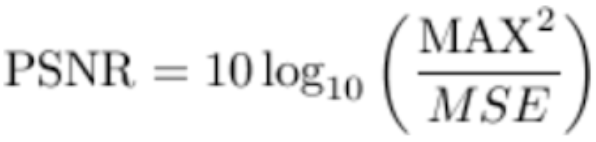

# UC Berkeley - EE 123 Sp19 Video Communication Project
Note: Requires at least 2 Raspberry Pis.

Please read the documentation `ee123_commands.rtf` under 
`ee123-sp19-project/ee123_project_code` directory.

All codes are under `ee123-sp19-project/ee123_project_code` directory.

Run python3 -u `<file_name>.py`

## Video Communication
The project is an open competition in which the winning team will get to keep their radios and interfaces.

#### Task:
Your task in the project will be to send the best quality video in 75 seconds.

- There are no general limits on the technique you choose to transmit. For example, it could be analog or digital. We recommend that you leverage Lab5 for your project, but you don't have to.

There are a few exceptions though:
- You cannot use existing implementations of compression algorithms.
- You cannot use existing implementations of communication techniques.

You can use:

- Existing implementations of entropy coding compression: Zip, gzip, huffman coding
- **NEW** You can use PyWavelet, or Python DCT -- but if you implement your own, it will count towards more score in your scope of project.
- Existing implementations of error correcting codes

#### Specs
- You have 75 seconds for pure data communication, if you use afsk1200 with no overhead, that's 11250 bytes total. If we assume overhead of 1/3 of the communication that leaves 7500 bytes. With 24 bits/pixel that is about 2500 color pixel you could transmit using lab5 material. This is the minimum quality we will accept, and you can only improve on that.

- For your demo, you will be given a video (Tiff stack). The video could be of arbitrary size. The video will be chosen on the day of the project and presented to the competitors only on that day on a usb stick -- or a link on the web.

- The files will be multi-page PNG,  whose filenames are "[FILENAME].png". Your code should be able to read them once you copied to the appropriate directory
- The receiver should produce a video of the exact same size as the one transmitted (not necessarily the same quality though)
- We will provide example videos on this page for you to practice on

Minimum passing grade:

- Use the 1200b/s AFSK packet modem developed in labs 4,5.
- Load the video, find its dimensions: W * H * T
- Resample each color channel in space an time to dimensions for which W_d * H_d *T_d <= 2500, the total number of bytes you can send in 75s.
Quantize the result to 8-bit unsigned integer (0-255) 
- Convert the pixel data to binary array. Packetise the data.  (including information on how to construct the size of the original video)
- Send the data using your modem -- receive with another PI. 
- Convert from packets to pixel data, and reshape. 
- Interpolate the video to its original size

### Evaluation:

- For each of the video below, you should have a result of a transmission and the resulting PSNR that you got. This should be ready at the time of the presentation. In addition, you will submit the resulting images on bcourses.
- At the demo, we will ask you to show us two transmissions. In addition, we will provide you with one or two new videos (TIFF stack format) to demo. 
The video quality evaluation will be done by

- Qualitative assessment 1-10 by the staff of the class.
- Peak Signal-to-Noise Ratio measure (PSNR) which is defined as: 

, where MAX is the maximum possible image pixel value (255 for 8bits) and MSE is the mean-square error, or can be expressed as:
.png)

This assumes RGB videos are compared, where each color channel has M-by-N pixels and the total number of frames is T.

* Make sure that the radio transmit timeout setting (TOT Menu + 9) is set to at least 90 seconds.

### Reference:
Site: https://sites.google.com/berkeley.edu/ee123-sp19/project?authuser=0

